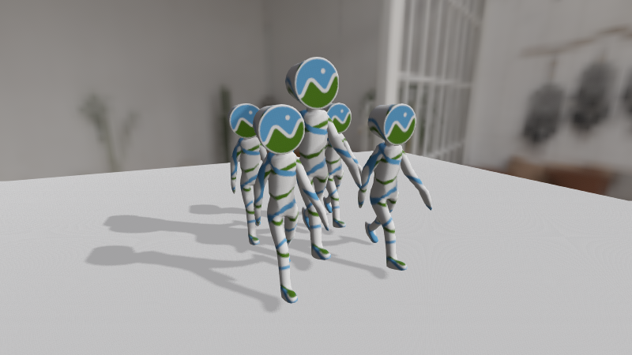
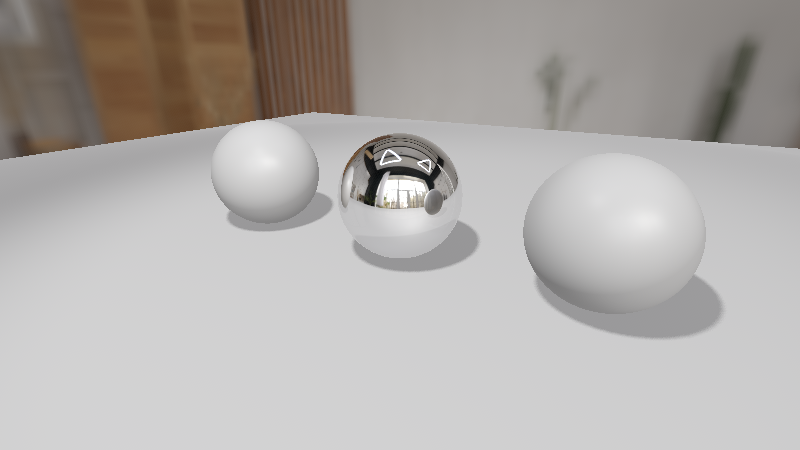
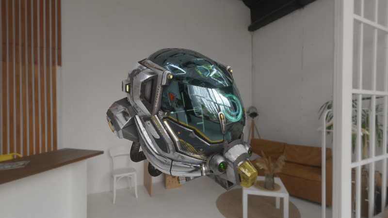
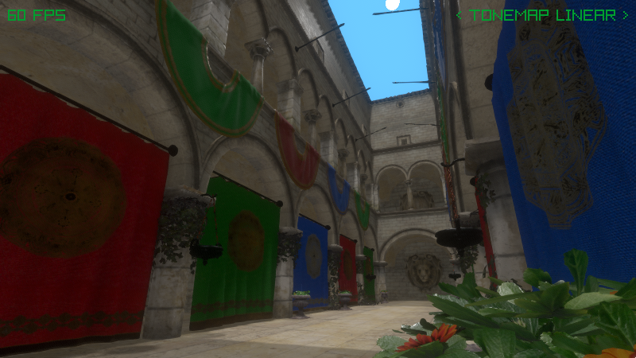

#  - 3D Rendering Library for raylib (free pascal binding)


<br>
R3D is a modern 3D rendering library for <a href="https://www.raylib.com/">raylib</a> that provides advanced lighting, shadows, materials, and post-processing effects without the complexity of building a full engine from scratch.
<br clear="left">


## Key Features

- **Hybrid Renderer**: Deferred pipeline with forward rendering for transparency.
- **Advanced Materials**: Complete PBR material system (Burley/SchlickGGX)
- **Custom Shaders**: Support for surface shaders (materials/decals) and screen shaders.
- **Dynamic Lighting**: Directional, spot, and omni lights with soft shadows
- **Image-Based Lighting**: Supports environment IBL and reflection probes.
- **Post-Processing**: SSAO, SSR, DoF, bloom, fog, tonemapping, and more
- **Kinematics Support**: Basic kinematic system with capsule and mesh-based colliders.
- **Mesh Utilities**: Mesh generation, manipulation, and helper utilities.
- **Model Loading**: Assimp integration with animations and mesh generation
- **Performance**: Built-in frustum culling, instanced rendering, and more

## Installation

```
Open and complile package/ray4laz_r3d.lpk
```

**Requirements package**: ray4laz 

## Quick Start

```pascal
program r3dexample;

{$mode objfpc}{$H+}

uses
  SysUtils, raylib, r3d, raymath;

const
  SCREEN_WIDTH = 800;
  SCREEN_HEIGHT = 600;

var
  mesh: TR3D_Mesh;
  material: TR3D_Material;
  light: TR3D_Light;
  camera: TCamera3D;

begin
  // Initialize window
  InitWindow(SCREEN_WIDTH, SCREEN_HEIGHT, 'R3D Example');
  SetTargetFPS(60);

  // Initialize R3D
  R3D_Init(SCREEN_WIDTH, SCREEN_HEIGHT);

  try
    // Create scene objects
    mesh := R3D_GenMeshSphere(1.0, 16, 32);
    material := R3D_GetDefaultMaterial();

    // Setup lighting
    light := R3D_CreateLight(R3D_LIGHT_DIR);
    R3D_SetLightDirection(light, Vector3Create(-1, -1, -1));
    R3D_SetLightActive(light, True);

    // Camera setup
    camera.position := Vector3Create(3, 3, 3);
    camera.target := Vector3Create(0, 0, 0);
    camera.up := Vector3Create(0, 1, 0);
    camera.fovy := 60.0;
    camera.projection := CAMERA_PERSPECTIVE;

    // Main loop
    while not WindowShouldClose() do
    begin
      UpdateCamera(@camera, CAMERA_ORBITAL);

      BeginDrawing();
        ClearBackground(BLACK);

        R3D_Begin(camera);
          R3D_DrawMesh(mesh, material, Vector3Zero(), 1.0);
        R3D_End();

        // Draw FPS
        DrawFPS(10, 10);
      EndDrawing();
    end;

  finally
    // Cleanup
    R3D_UnloadMesh(mesh);
    R3D_Close();
    CloseWindow();
  end;
end.                                                   
```

## License

Licensed under the **MIT License** - see [LICENSE](LICENSE) for details.

## Screenshots

<table>
  <tr>
    <td></td>
    <td></td>
  </tr>
  <tr>
    <td></td>
    <td></td>
  </tr>
</table>

